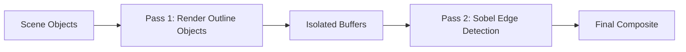

# 🎯 URP Screen-Space Outline System

> **Clean, crisp outlines for Unity URP** - Perfect for RTS games, selection systems, and modern UI feedback

[](https://unity.com/)
[](https://docs.unity3d.com/Packages/com.unity.render-pipelines.universal@latest)
[](LICENSE)

## ✨ Features

- 🎯 **Selective Outlining** - Only outline what you want
- ⚡ **Performance Optimized** - Two-pass rendering with smart culling
- 🔧 **No Material Changes** - Works with any existing materials
- 🎮 **Runtime Control** - Enable/disable outlines dynamically
- 🚀 **URP Integration** - Built for Universal Render Pipeline

## 🚀 Quick Start

### 1. Setup Renderer Feature
1. Open your **Universal Renderer Data** asset
2. Add **"Edge Detection Outline Feature"**
3. Configure your outline settings

### 2. Enable Required Buffers
In your **URP Asset**, enable:
- ✅ **Depth Texture**
- ✅ **Opaque Texture**

### 3. Add to GameObjects
```csharp
// Add OutlineObject component to any GameObject
var outline = gameObject.AddComponent<OutlineObject>();
outline.SetOutlineEnabled(true);
```

## 📁 What's Included

| File | Purpose |
|------|---------|
| `EdgeDetectionOutlineFeature.cs` | URP Renderer Feature implementation |
| `EdgeDetectionOutline.shader` | Sobel edge detection shader |
| `OutlineObject.cs` | Component for controlling outlined objects |

## ⚙️ Configuration

### Outline Appearance
- **Color** - RGBA outline color
- **Thickness** - Edge detection sampling distance

### Detection Sensitivity
- **Depth** (0-1) - Object silhouettes
- **Normal** (0-1) - Surface details  
- **Color** (0-1) - Texture boundaries

### Rendering Layers
Uses Unity's **Rendering Layers** (separate from GameObject layers):
- Layer 0 = Mask 1
- Layer 1 = Mask 2
- Layer 2 = Mask 4

## 💡 How It Works



1. **Pass 1**: Render only outline objects to separate textures
2. **Pass 2**: Apply Sobel edge detection and composite back

## 🎮 Runtime API

```csharp
// Basic control
OutlineObject outline = GetComponent<OutlineObject>();
outline.SetOutlineEnabled(true);
outline.SetOutlineRenderingLayer(1);

// Check status
bool isOutlined = outline.IsCurrentlyOutlined();
```

## 🔧 Troubleshooting

| Issue | Solution |
|-------|----------|
| No outlines visible | Check URP settings, rendering layer masks, and sensitivity values |
| Wrong objects outlined | Verify rendering layer settings on OutlineObject components |
| Outlines too thick/thin | Adjust **Outline Thickness** parameter |
| Performance issues | Reduce thickness, use fewer outlined objects |

## 🎯 Why Rendering Layers?

**GameObject Layers** → Collisions, culling, lighting  
**Rendering Layers** → Visual effects only

This keeps your collision detection clean while giving you powerful outline control!

## 📋 Requirements

- Unity 2022.3+
- Universal Render Pipeline 12.0+
- Depth Texture enabled
- Opaque Texture enabled

## 🤝 Contributing

Found a bug or have an improvement? Feel free to open an issue or submit a PR!

---

<div align="center">
  <strong>Made with ❤️ for the Unity community</strong>
</div> 